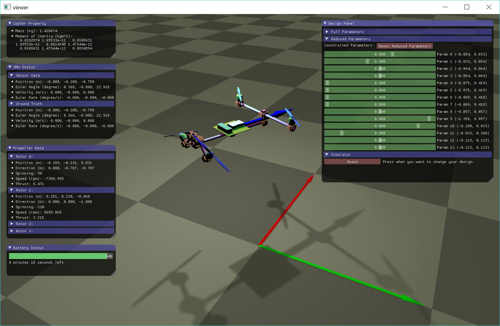
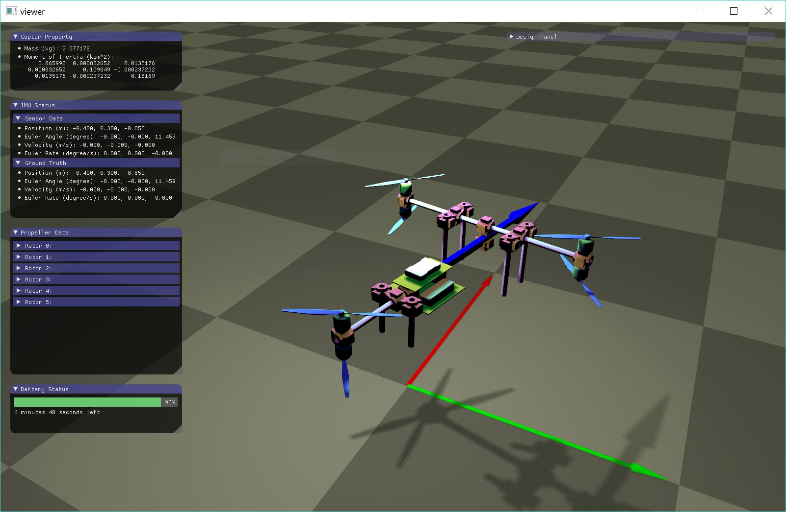
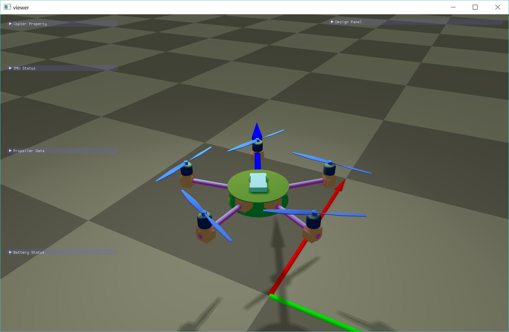

# Multicopter Design

Authors: Tao Du, Adriana Schulz, Bo Zhu

Affiliation: MIT CSAIL

This project develops a design, simulation and optimization tool for casual
users to build their own multicopters. It was a research project led by the
[Computational Fabrication Group](http://cfg.mit.edu) at
[MIT CSAIL](https://www.csail.mit.edu/) in 2015.

## Gallary





Please refer to [docs/user_guide.pdf](docs/user_guide.pdf) for more
information.

## Supported platforms
* Windows: tested on Windows 10 64bit and Microsoft Visual Studio 2017.
* Linux: tested on Ubuntu 16.04 LTS and gcc 4.9.0.
* macOS: tested on Sierra 10.12.3 and AppleClang 8.1.0.

## Dependencies
All of them are by default not included in the distribution. You need to use
git submodule and the provided script to download and configure them.
* graphics_codebase: my own graphics viewer (git submodule + script).
* nlopt: an open-source C++ optimization library (git submodule).
* tinyxml2: an XML parser (git submodule).

## How to build
Use git to clone the project from github. Note that `--recursive` is necessary
or you will have to pull the submodule manually:
```bash
git clone --recursive https://www.github.com/mit-gfx/multicopter_design.git
```
Run the script corresponding to your system to download dependencies. For
Windows:
```bash
./windows_setup.ps1
```
For linux:
```bash
./linux_setup.sh
```
For macOS:
```bash
./macos_setup.sh
```

Below we will use `MULTICOPTER_DESIGN_PROJECT` to refer to the location of this
project. The structure of the folder after you clone or download the project
should look like:
* `MULTICOPTER_DESIGN_PROJECT`
  * `docs/`: a user guide.
  * `externals/`: external libraries (see above).
  * `projects/`: main source code.
    * `copter_simulation/`: the core library.
    * `copter_viewer/`: a viewer depending on copter_simulation.
  * `resources/`:
    * `copter/`: XML files that define a copter. You are free to add your own
      XML files here.
    * `mesh/`: 3D meshes we use to assemble our real copter. Files like
      connector.obj are 3D printable. In generally you should not touch any
      file here.
    * `measurement/`: our propeller/motor/battery measurement data for your
      reference if you plan to do your own measurement.
  * `.gitignore`
  * `.gitmodules`
  * `CMakeLists.txt`
  * `linux_setup.sh`
  * `macos_setup.sh`
  * `readme.txt`: this file.
  * `windows_setup.ps1`

Depending on our operation system, follow the corresponding instructions:

### Windows
* Open cmake-gui. Put your own `MULTICOPTER_DESIGN_PROJECT` in "Where is the
source code", and put your desired build folder in "Where to build the
binaries". The build folder can be any folder you like, but we recommend using
an empty folder outside `MULTICOPTER_DESIGN_PROJECT`.
* Click "Configure", then selected "Visual Studio 15 2017 Win64" and click
"Finish". Once it is done, click "Generate". Now navigate to your build folder,
open the solution "multicopter_design.sln", and press `F7` to build the
solution.
* Set `copter_viewer` as your startup project, then press `F5' to run. You
should be able to see an viewer showing a pentacopter by default.

### Linux
Make sure you have OpenGL and dependency libraries installed:
```bash
sudo apt-get install libgl1-mesa-dev mesa-common-dev xorg-dev
sudo apt-get install libglu1-mesa libglu1-mesa-dev
```
Go to the parent folder of your `MULTICOPTER_DESIGN_PROJECT`, and create an
empty build folder:
```bash
cd MULTICOPTER_DESIGN_PROJECT
cd ../
mkdir multicopter_design_build_gcc
cd multicopter_design_build_gcc
```
Use `cmake` to do an out-of-source build, and run `make` to compile:
```bash
cmake ../multicopter_design
make
```
Once it is done you can try to run the default example:
```bash
cd projects/copter_viewer
./copter_viewer
```
You will see a pentacopter example by default.

### macOS
Pretty much the same except that you do not need to install OpenGL libraries.
Go to the parent folder of your `MULTICOPTER_DESIGN_PROJECT`, and create an
empty build folder:
```bash
cd MULTICOPTER_DESIGN_PROJECT
cd ../
mkdir multicopter_design_build_macos
cd multicopter_design_build_macos
```
Use `cmake` to do an out-of-source build, and run `make` to compile:
```bash
cmake ../multicopter_design
make
```
Once it is done you can try to run the default example:
```bash
cd projects/copter_viewer
./copter_viewer
```
You will see a pentacopter example by default.

## User interaction
* Use your mouse to change the view: scroll to scale, press the wheel to rotate
and press the wheel + `shift` to translate.
* Drag the slide bar on the right to change the design. Once you are happy,
scroll down and click the "simulate" button.
* Use your keyboard to control the motion of the copter (`left/right/up/down`
arrows and `a`, `d`, `w`, `s`). Press `p` to pause/resume.

## Attribution
```bibtex
@article{du2016computational,
  title={Computational multicopter design},
  author={Du, Tao and Schulz, Adriana and Zhu, Bo and Bickel, Bernd and Matusik, Wojciech},
  journal={ACM Transactions on Graphics (TOG)},
  volume={35},
  number={6},
  pages={227},
  year={2016},
  publisher={ACM}
}
```

## Contact
Please email taodu@csail.mit.edu if you have general questions or comments. For
troubleshooting please post an issue on github.